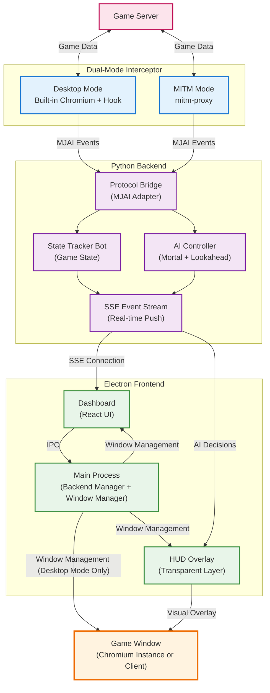
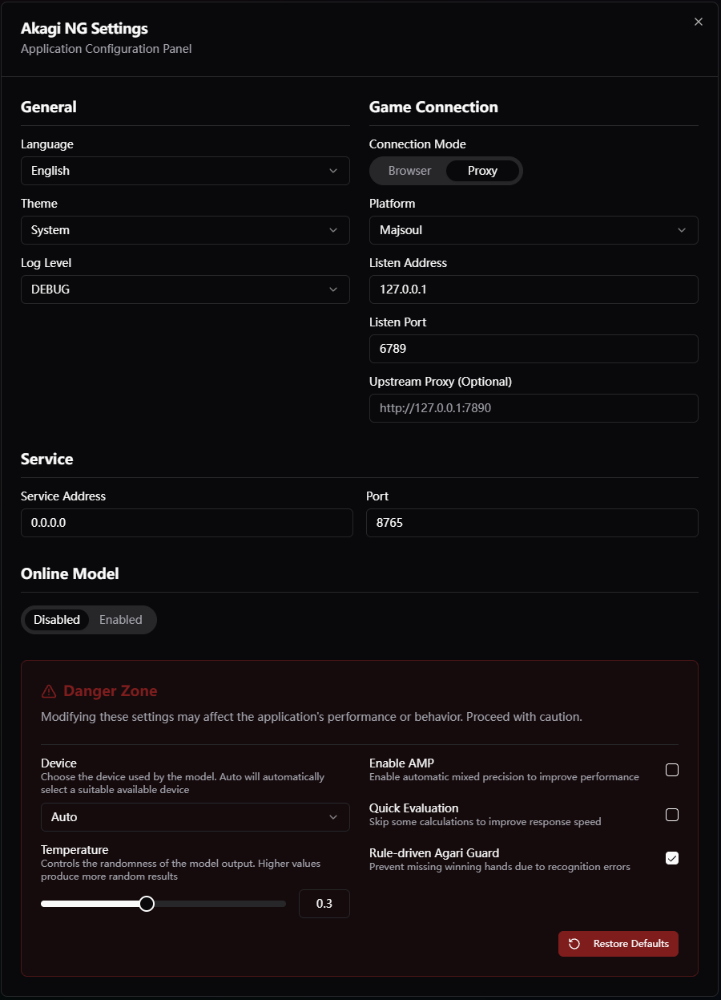

<div align="center">
  
  <h1>Akagi-NG</h1>

  <p>
    Next Generation Mahjong AI Assistant<br>
    Inspired by <b>Akagi</b> and <b>MajsoulHelper</b>
  </p>
<p><i>「死ねば助かるのに……」— 赤木しげる</i></p>

<p>
<a href="https://github.com/Xe-Persistent/Akagi-NG/actions/workflows/test.yml"></a>
<a href="https://github.com/Xe-Persistent/Akagi-NG/releases"></a>
<a href="https://github.com/Xe-Persistent/Akagi-NG/stargazers"></a>
<br>


<br>


<a href="https://discord.gg/Z2wjXUK8bN"></a>
<a href="https://codecov.io/gh/Xe-Persistent/Akagi-NG"></a>
</p>

<p align="center">
  <a href="./README_ZH.md">简体中文</a> | <b>English</b>
</p>
</div>

---

## What is Akagi-NG?

**Akagi-NG** is the next-generation rewrite of the original **Akagi** project.

It is an AI-powered assistant designed for Japanese Mahjong (Riichi Mahjong), aimed at providing real-time situation analysis and decision recommendations for online Mahjong games.

Core Philosophy of Akagi-NG:

- **Modern Architecture**: Rebuilt based on Electron-native architecture, Python 3.12 and React/Vite
- **Decoupled Design**: Complete separation of core logic, user interface, configuration management, and AI models
- **High-Performance Inference**: Integrated `libriichi` for blazing fast Mortal model inference capabilities
- **Long-term Maintainability**: Optimized code structure for continuous iteration

---

## Core Architecture

The graph below is the overall data flow of Akagi-NG in Electron desktop / MITM modes.

**Components:**

- **Dual-Mode Interceptor**: Provides two methods for game data acquisition
  - **Desktop Mode**: Intercepts game communication via built-in Chromium browser + resource hooks, no proxy/certificate configuration needed
  - **MITM Mode**: Intercepts traffic from external browsers/clients via mitmproxy, supports third-party devices

- **Python Backend (DataServer)**: Core data processing hub, running on port `:8765`
  - **Protocol Bridge**: Converts Mahjong Soul protocol to MJAI standard format
  - **State Tracker Bot**: Maintains complete game state machine
  - **AI Controller**: Manages AI model and Lookahead algorithm, provides decision recommendations
  - **SSE Event Stream**: Pushes AI decisions to frontend in real-time via Server-Sent Events

- **Electron Frontend**: User interface and window management
  - **Main Process**: Manages backend process and coordinates multiple windows
  - **Dashboard**: Provides configuration management and game launch entry
  - **HUD Overlay**: Transparent overlay window displaying AI recommendations in real-time

- **Game Window**: Final game presentation layer
  - In Desktop Mode: Chromium instance managed by Electron
  - In MITM Mode: User's own browser or game client

**Data Flow:**

1. Game Server → Interceptor: Raw game data transmitted via WebSocket
2. Interceptor → Python Backend: Converted to MJAI event format
3. Python Backend Processing: State tracking + AI decision computation
4. Python Backend → Electron: Pushes decision results via SSE
5. HUD Overlay: Displays AI suggestions overlaid on game window



---

## Features

- 🎮 **Supported Platforms**
  - Mahjong Soul
  - Tenhou
  - Riichi City
  - Amatsuki Mahjong

- 🀄 **Supported Modes**
  - Four-Player Mahjong (4p)
  - Three-Player Mahjong (3p)

- 🤖 **AI Models**
  - Mortal (Mortal 4p / Mortal 3p)
  - AkagiOT (AkagiOT 4p / AkagiOT 3p)

- 🧠 **Core Functions**
  - Real-time hand analysis and AI discard recommendations
  - Riichi Lookahead - Intelligent recommendation for the best discard after reaching
  - Comprehensive Fuuro Support - Clear action prompts for Chi, Pon, and all Kan variants
  - Modern Glassmorphism HUD - Smooth and unobtrusive floating window experience
  - Multi-language support - Simplified Chinese / Traditional Chinese / Japanese / English

> [!NOTE]
> **Riichi Lookahead** is a core feature in Akagi-NG, designed to solve the question: "When AI suggests Riichi, which tile should I discard?"
>
> <details>
> <summary><b>Click to view detailed logic of Riichi Lookahead</b></summary>
>
> **1. Why do we need it?**
>
> When the MJAI engine (such as Mortal) suggests a `reach` operation, the protocol only returns the action `{"type": "reach"}`. It does **not** directly tell us which tile to discard after declaring Riichi (e.g., `6m`).
> However, for the user, after clicking the "Riichi" button, a tile must be discarded. Without Lookahead, the user can only guess or judge which tile to cut themselves, which may lead to deviations from the AI's intended strategy (e.g., discarding the wrong tile resulting in furiten or dealing into another player's hand).
>
> **2. How it works**
>
> The core idea of Lookahead is **"Simulating the Future"**. When the AI suggests Riichi, we create a temporary parallel universe, assume the player has declared Riichi, and then ask the AI what it would discard in that state.
>
> The process is divided into the following steps:
>
> 1. **Trigger**: In the current situation, the AI engine infers that `Riichi` is one of the top 5 best actions.
> 2. **Start Simulation**: Akagi-NG creates a new, temporary `Simulation Bot`.
> 3. **History Replay**:
>    - In order for the simulation bot to reach the current game state, we need to feed it all events that have occurred from the beginning of the game to the present (draws, discards, calls, etc.).
>    - **Old Mechanism**: When replaying every move of "my own actions", the simulation bot would foolishly ask the AI engine: "What should I do now?". This meant that if a game was in the 15th turn, Lookahead would need to perform 15+ AI inferences. For Online mode, this meant 15 HTTP requests, instantly triggering a 429 ban.
>    - **New Mechanism (ReplayEngine)**: We now use the `ReplayEngine` wrapper. During the replay phase, we explicitly know that this is just "retelling history", so when the simulation bot asks "What should I do now?", `ReplayEngine` directly returns a dummy action (such as `tsumogiri`), **completely skipping AI inference**. This makes the replay process almost instantaneous and with zero network cost.
> 4. **Branching**:
>    - When the state is fully restored to "now", we manually send a `Riichi` event to the simulation bot.
>    - At this point, the internal state of the simulation bot becomes: "The player has just declared Riichi and is waiting to discard a tile".
> 5. **Final Inference**:
>    - In this new "Declared Riichi" state, we initiate a **real** inquiry to the AI engine: "Which is the best discard now?"
>    - The engine analyzes the situation and returns a specific discard action (e.g., `discard 6m`).
> 6. **Result Display**: The frontend UI receives this `6m` information. The interface will highlight Riichi and other discard recommendations (such as `damaten`). It will also display the recommended discard tile `6m` in the Riichi recommendation sub-item. If there is more than one Riichi discard candidate, the sub-items will display each Riichi discard tile and its confidence respectively.
> </details>

## Demo

https://github.com/user-attachments/assets/b15d1f76-3009-448d-9648-0d2ffd4f3b7e

## Screenshots

### Main Interface


### Settings Panel



---

## ⚠️ Disclaimer

This project is for **educational and research purposes only**.

Using third-party auxiliary tools in online games may violate the game's Terms of Service.
The authors and contributors of Akagi-NG are **NOT responsible for any consequences**, including but not limited to **account bans or suspensions**.

Please fully understand and assume the relevant risks before use.

---

## Installation & Usage

### 1. Quick Start

1. **Download**: Go to [Releases](../../releases) and download the latest version, then extract it.
2. **Deploy**: Place AI model weight files (`.pth`) in the `models/` directory, and binary extensions (`.pyd`/`.so`) in the `lib/` directory.
3. **Run**: Double-click `Akagi-NG.exe`.
4. **Play**: Click "**Launch Game**" in the Dashboard and click the monitor icon at the top right to enable **HUD**.

---

### 2. Directory Structure

To ensure the program runs correctly, please verify the directory structure where `Akagi-NG.exe` is located:

```plain
Akagi-NG/
  ├── Akagi-NG.exe     # Main Application (Electron Desktop)
  ├── assets/          # Platform-specific UI assets
  ├── bin/             # Backend core executable directory
  ├── config/          # Configuration directory (settings.json)
  ├── lib/             # libriichi binary extensions (.pyd/.so)
  │     ├── libriichi.pyd
  │     └── libriichi3p.pyd
  ├── locales/         # Localization resource files
  ├── logs/            # Runtime log directory
  ├── models/          # AI model weight files (.pth)
  │     ├── mortal.pth
  │     └── mortal3p.pth
  ├── resources/       # Electron core resources (app.asar)
  ├── LICENSE.txt      # Open source license
  ├── README.txt       # Quick start plain text guide
  └── ...              # Other runtime files (.dll, .pak, etc.)
```

### 3. Play & Exit

When running `Akagi-NG.exe` for the first time, the integrated dashboard will appear. You can start the game directly from the dashboard to launch a dedicated browser window. Click the monitor icon in the top right of the dashboard to open the HUD overlay.

To exit the program, click the red power icon in the dashboard.

> [!TIP]
> **HUD (Heads-Up Display)** is a new feature in Akagi-NG, providing a sleek, translucent overlay directly on your game window without manual window sticking.

### 4. Configuration

All configurations for Akagi-NG are located in the `config/settings.json` file. You can click the gear icon in the top right of the dashboard to enter the settings panel to modify them, or use a text editor to modify this file to adjust program behavior.

### 5. Desktop Mode (Recommended)

This is the **default working mode** of Akagi-NG.

In this mode, Akagi-NG leverages its Electron core to manage a specialized Chromium instance for the game.

- **Key Features**:
  - **Zero Config**: No certificates or proxy settings needed.
  - **Environment Isolation**: Completely isolated from your daily used browser.
  - **Safe and Stable**: Receives data from the game server directly.

- **Usage**:
  1. Run `Akagi-NG.exe`.
  2. Click "Launch Game" in the dashboard.

### 6. MITM Mode

Akagi-NG supports intercepting game data via Man-in-the-Middle (MITM) attack. This allows you to play using any browser, client or on a mobile device (with proxy configured).

1. **Enable Configuration**:
   Switch on "External Proxy" in the configuration panel or modify the `mitm` field in `config/settings.json`:

   ```yaml
   "mitm": { "enabled": true, "host": "127.0.0.1", "port": 6789 }
   ```

2. **Set Proxy**:
   Set your browser or system proxy to `127.0.0.1:6789`.

3. **Install Certificate**:

   > Note: If you use Scheme B (Clash splitting), you may be unable to open `mitm.it`. **Method 2** is recommended.
   - **Method 1: Online Installation (Recommended for Scheme A Users)**
     - Start Akagi-NG.
     - Visit [http://mitm.it](http://mitm.it).
     - Download the Windows certificate (p12 or cer).

   - **Method 2: Local Installation (Recommended for Scheme B Users)**
     - Find the `.mitmproxy` folder under the user directory (e.g., `C:\Users\<YourName>\.mitmproxy`).
     - Double-click `mitmproxy-ca-cert.p12` to install.

   - **Critical Step**:
     - Double-click certificate -> Install Certificate -> Select Store Location "**Trusted Root Certification Authorities**".

> [!WARNING]
> Be sure to install the certificate into "**Trusted Root Certification Authorities**".

### 7. FAQ

**Q: I launched the program for the first time, but it hangs on the welcome/loading screen. What should I do?**
**A:** This is usually caused by a conflict with the DataServer's default port `8765`.
**Solution:**

1. Open `config/settings.json`.
2. Find `"server": { "port": 8765 }` and change `8765` to another available port (e.g., `8888`).
3. Restart the program.

**Q: I am using proxy software like Clash/v2rayN (TUN/System Proxy mode), how should I configure it?**

<details>
<summary><b>Click to view detailed proxy split configuration schemes</b></summary>

#### Configuration Scheme A: Browser Web Version (SwitchyOmega Proxy)

This scheme is suitable for **Web version** players, configuration is simplest and completely isolated.

**Configuration Steps (Taking Clash Verge Tun mode as an example)**:

1. **Prepare Environment**:
   - Keep Clash Verge Tun mode **ON**.
   - Ensure Akagi-NG is started and `mitm.enabled` is `true` (default port 6789).

2. **Install SwitchyOmega**:
   - Chrome/Edge users please search regarding "SwitchyOmega" in the store and install it.

3. **Configure Profile**:
   - Open SwitchyOmega settings interface.
   - Click **"New Profile"** on the left -> Name it `Akagi-Mitm` -> Select type **"Proxy Profile"**.
   - In `Akagi-Mitm` settings:
     - Protocol: `HTTP`
     - Server: `127.0.0.1`
     - Port: `6789`
   - Click **"Apply Changes"** on the left to save.

4. **Configure Auto Switch (Critical)**:
   - Click **"Auto Switch"** on the left.
   - Delete all existing rules (if any).
   - **Add Rules**:
     - Rule condition: `*.maj-soul.com  ->  Akagi-Mitm`
     - Rule condition: `*.majsoul.com  ->  Akagi-Mitm`
     - Rule condition: `*.mahjongsoul.com  ->  Akagi-Mitm`
   - **Default Rule**:
     - Select **"Direct"**, then click **"Apply Changes"** to save.

> [!TIP]
> Because your system has Tun mode enabled, "Direct" traffic will be automatically taken over and proxied by the Tun network card, so you don't need to select "System Proxy" or "Clash" here.

> [!IMPORTANT]
> If you don't enable Tun mode and only enabled System Proxy, please select "System Proxy" here.

5. **Start Game**:
   - Click the SwitchyOmega icon in the upper right corner of the browser and select **"Auto Switch"**.
   - Visit Mahjong Soul web version, Akagi-NG should be able to capture game events normally, while you can still access Google/YouTube (via Tun).

#### Configuration Scheme B: Mahjong Soul Client (Clash Rule Splitting)

This scheme is suitable for **PC/Steam Client** players. Since the client cannot use plugins for splitting like a browser, we need to directly modify the Clash configuration to forward game traffic to Akagi-NG.

> [!IMPORTANT]
> When playing with the PC/Steam client, please ensure Clash is in TUN mode, otherwise it will not be able to proxy client traffic.

1. **Find Configuration Entry**:
   - Find your configuration file in Clash Verge (or use "Merge" / "Script" function to inject, to avoid overwriting the original configuration).

2. **Add Proxy Node (Proxies)**:
   Define a node pointing to the Akagi-NG local proxy.

   ```yaml
   proxies:
     - name: Akagi-Mitm
       type: http
       server: 127.0.0.1
       port: 6789
       tls: false
   ```

   You can also define a proxy group (Proxy-groups) containing the local proxy node and Direct, making it convenient to toggle whether to use the Akagi-NG local proxy.

   ```yaml
   proxy-groups:
     - name: 🀄 Mahjong Soul
       proxies:
         - Akagi-Mitm
         - DIRECT
       type: select
   ```

3. **Add Splitting Rules (Rules)**:
   Force Mahjong Soul related domains to point to the node defined above. Please note the rule order, it is recommended to place them near the top.

   ```yaml
   rules:
     - PROCESS-NAME,akagi-ng.exe,DIRECT
     - PROCESS-NAME,雀魂麻將,🀄 Mahjong Soul
     - PROCESS-NAME,Jantama_MahjongSoul.exe,🀄 Mahjong Soul
     - DOMAIN-Keyword,maj-soul,🀄 Mahjong Soul
   ```

4. **Apply Configuration**:
   Save and refresh the Clash configuration. Now start the Mahjong Soul client, the traffic path is:
   `Mahjong Soul Client -> Clash (TUN) -> Matches Rules -> Forward to Akagi-NG (6789) -> Your Network/Upstream Proxy`

</details>

---

## Source Code Build Guide

### Prerequisites

- **Python 3.12+**: Required for the backend engine.
- **Node.js 24+ & npm**: Required for the Electron desktop and React frontend.
- **Git**: For cloning the repository.
- **Windows**: Recommended development and build platform.

### 1. Project Initialization

Clone the repository and initialize the project:

```bash
git clone https://github.com/Xe-Persistent/Akagi-NG.git
cd Akagi-NG
```

#### Backend Setup

The integrated build system expects a virtual environment in the `akagi_backend` directory:

```bash
cd akagi_backend
python -m venv .venv
# Windows
.\.venv\Scripts\activate
# Linux/macOS
source .venv/bin/activate

pip install -e .
cd ..
```

#### Frontend & Desktop Setup

```bash
# Install frontend dependencies
cd akagi_frontend
npm install

# Install electron desktop dependencies
cd ../electron
npm install
```

### 2. Running in Development

To launch the integrated development environment:

```bash
cd electron
npm run dev
```

### 3. Building for Production

To package the application for your current platform:

```bash
cd electron
npm run build
```

The build artifacts will be generated in the `dist/release` directory.

> [!IMPORTANT]
> The build process packages the application core. You still need to ensure that AI model weight files (`.pth`) are placed in the `models/` directory and binary extensions (`.pyd`/`.so`) are in the `lib/` directory of the release folder for the program to function.

---

## Open Source License

This software follows the [GNU Affero General Public License version 3 (AGPLv3)](LICENSE) open source protocol.
