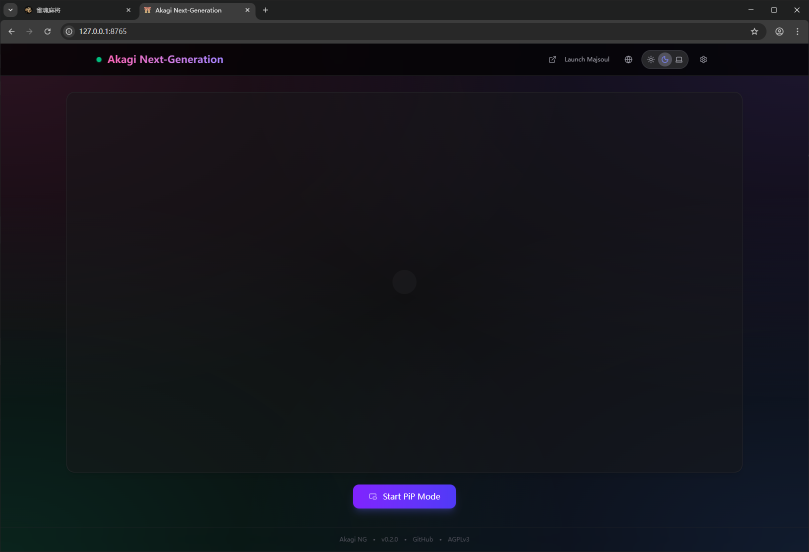
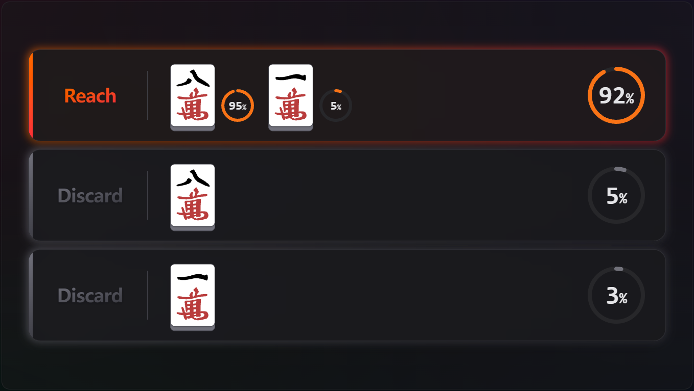
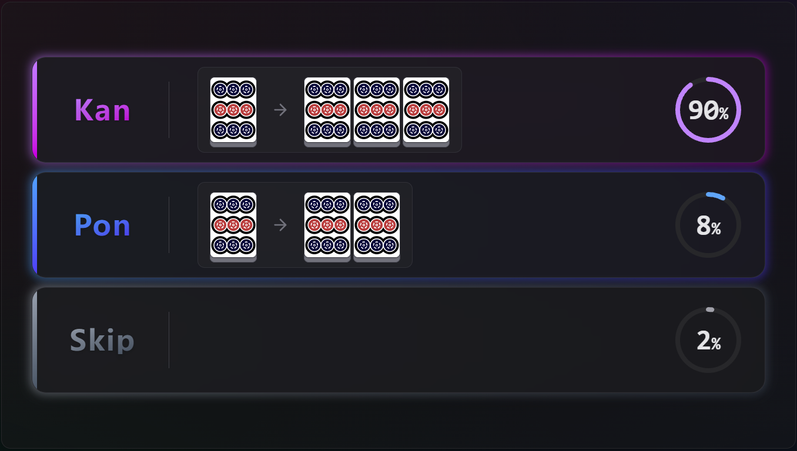
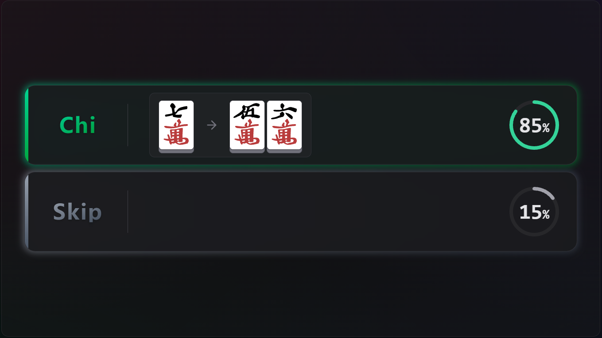

<div align="center">
  
  <h1>Akagi-NG</h1>

  <p>
    Next Generation Mahjong AI Assistant<br>
    Inspired by <b>Akagi</b> and <b>MajsoulHelper</b>
  </p>
<p><i>「死ねば助かるのに……」— 赤木しげる</i></p>

  
  
  
</p>

<p align="center">
  <a href="./README_ZH.md">简体中文</a> | <b>English</b>
</p>
</div>

---

## What is Akagi-NG?

**Akagi-NG** is a next-generation rewrite of the original **Akagi** project.

It is an AI-powered assistant for Japanese Mahjong (Riichi Mahjong), designed to provide **real-time analysis and
decision recommendations** while playing games such as **Mahjong Soul (雀魂)**.

Akagi-NG focuses on:

- A **modernized architecture** (Python 3.12 + React/Vite)
- Cleaner separation between core logic, UI, configuration, and models
- High-performance Mortal implementation utilizing `libriichi` extensions
- Long-term maintainability

---

## ⚠️ Disclaimer

This project is provided **for educational and research purposes only**.

Using third-party tools with online games may violate the game’s Terms of Service.  
The author of Akagi-NG is **not responsible for any consequences**, including but not limited to **account suspension or
bans**.

You are responsible for understanding the risks.

---

## Current Scope

- 🎮 **Supported game**
    - Mahjong Soul (雀魂)

- 🀄 **Game modes**
    - Four-player Mahjong
    - Three-player Mahjong

- 🤖 **AI models**
    - Mortal (Mortal 4p / Mortal 3p)

- 🧠 **Core features**
    - Real-time hand analysis with AI recommendations
    - Riichi discard lookahead (simulate best discard when reaching)
    - Consolidated Kan logic (Chi/Pon/Ankan/Kakan/Daiminkan)
    - Modern web-based overlay UI
    - Multi-language support (Simplified Chinese / Traditional Chinese / Japanese / English)


## Screenshots


### Main Interface


### Standard Discard


### Riichi Lookahead


### Pon & Kan


### Kan Selection


### Chi



---


## Installation & Usage

### 1. Download Release

Check the [Releases](../../releases) page for the latest version.

### 2. Prepare Resources

Akagi-NG requires external AI models and libraries to function.  
You must place the following folders in the same directory as `akagi-ng.exe`:

```
akagi-ng/
  ├── akagi-ng.exe
  ├── config/          # Configuration files
  ├── lib/             # libriichi binary extensions (.pyd)
  │     ├── libriichi.pyd
  │     └── libriichi3p.pyd
  └── models/          # Mortal model weights (.pth)
        ├── mortal.pth
        └── mortal3p.pth
```

### 3. Run

Execute `akagi-ng.exe`. The application will launch a dedicated browser instance for Mahjong Soul and open the overlay
interface.

---

## Build from Source

### Requirements

- Python **3.12 or newer**
- Node.js & npm (for frontend)
- Windows (primary development target)
- Git

### 1. Clone & Setup

```bash
git clone https://github.com/Xe-Persistent/Akagi-NG.git
cd Akagi-NG

# Create virtual environment
python -m venv .venv
.venv\Scripts\activate

# Install dependencies
pip install -e .
python -m playwright install
```

### 2. Build Frontend

```bash
cd akagi_frontend
npm install
npm run build
```

### 3. Run Development Version

```bash
python -m akagi_ng
```

### 4. Build Release Package

To create a standalone ZIP package:

```bash
python build_release.py
```

This will generate a versioned ZIP file in the `dist/` directory.

---

## Configuration

Settings are stored in `config/settings.json`. You can modify this file to change:

- Application settings
- Model parameters
- UI preferences

---

## License

This software is licensed under the [GNU Affero General Public License version 3 (AGPLv3)](LICENSE).
