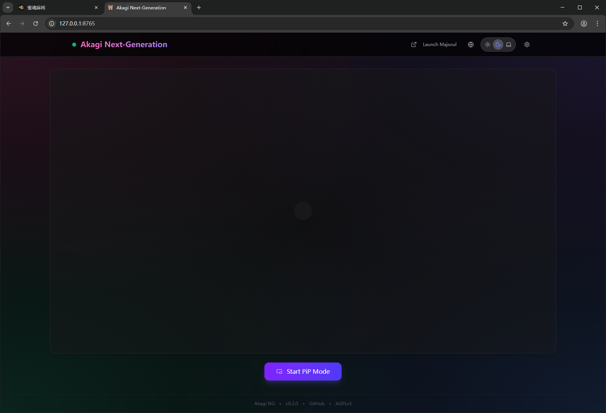
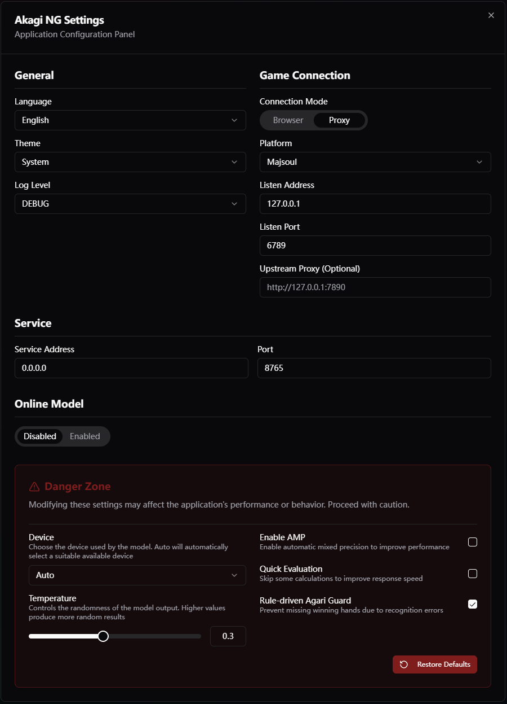

<div align="center">
  
  <h1>Akagi-NG</h1>

  <p>
    Next Generation Mahjong AI Assistant<br>
    Inspired by <b>Akagi</b> and <b>MajsoulHelper</b>
  </p>
<p><i>「死ねば助かるのに……」— 赤木しげる</i></p>

<p>
<a href="https://github.com/Xe-Persistent/Akagi-NG/actions/workflows/test.yml"></a>
<a href="https://github.com/Xe-Persistent/Akagi-NG/releases"></a>
<a href="https://github.com/Xe-Persistent/Akagi-NG/stargazers"></a>
<br>


<br>


<br>

<a href="https://discord.gg/Z2wjXUK8bN"></a>
<a href="https://codecov.io/gh/Xe-Persistent/Akagi-NG"></a>
</p>

<p align="center">
  <a href="./README_ZH.md">简体中文</a> | <b>English</b>
</p>
</div>

---

## What is Akagi-NG?

**Akagi-NG** is the next-generation rewrite of the original [Akagi](https://github.com/shinkuan/Akagi) project.

It is an AI-powered assistant designed for Japanese Mahjong (Riichi Mahjong), aimed at providing real-time situation analysis and decision recommendations for online Mahjong games.

Core Philosophy of Akagi-NG:

- **Modern Architecture Practices**: Fully embrace Python 3.12, React 19 and TS 6.0, constructing a stable, smooth and high-performance system foundation with cutting-edge engineering standards.
- **Ultimate Inference Performance**: Deeply integrate with the high-speed `libriichi` Rust engine, providing full-speed inference capabilities for Mortal-series AI models based on Pytorch.
- **Deeply Decoupled Design**: Highly decouple the decision core and interaction system, providing built-in browser mode and MITM proxy mode, flexibly adapting to various usage environments.
- **Riichi Lookahead Feature**: Utilize `Riichi Lookahead` mechanism, completely presenting the model's hidden strategies during the Riichi phase, eliminating AI decision blind spots.

---

## Features

- 🖥️ **Compatible Platforms**
  - Windows 10 & 11
  - macOS (Apple Silicon only)
  - Linux

- 🎮 **Supported Games**
  - Mahjong Soul
  - Tenhou
  - Riichi City
  - Amatsuki Mahjong

- ✨ **Core Features**
  - Real-time hand analysis and AI discard recommendations
  - Riichi Lookahead - Intelligent recommendation for the best discard after reaching
  - Comprehensive Fuuro Support - Clear action prompts for Chi, Pon and all Kan variants
  - Modern Glassmorphism Style - Smooth and transparent visual experience
  - Multi-language support - Simplified Chinese / Traditional Chinese / Japanese / English

- 🤖 **AI Models**
  - Mortal (Mortal 4p / Mortal 3p), always loaded as the offline fallback
  - Akagi V3 cloud inference (`/v3/react`) with separate 4P/3P model selection
  - API health, key limits, expiry, and available models can be checked directly in Settings

Cloud inference defaults to `https://mjapi.shinkuan.me` and stays disabled until a key is configured. Each
decision uploads the current seat-censored MJAI kyoku stream. A 2-second live timeout and exponential
5–120 second circuit breaker ensure an unreachable, rate-limited, or invalid-key service immediately falls
back to the bundled Mortal model. API URL, key, enabled state, and model changes apply to the next decision.

> [!NOTE]
> **Riichi Lookahead** is a core feature in Akagi-NG, designed to solve the question: "When AI suggests Riichi, which tile should I discard?"
>
> <details>
> <summary><b>Click to view detailed logic of Riichi Lookahead</b></summary>
>
> **1. Why is it needed?**
>
> When the AI engine (Mortal Bot) suggests a Riichi operation, the MJAI protocol simply returns an action `{"type": "reach"}`, and does not directly tell us which tile to discard after declaring Riichi (e.g., `6m`). However, for the user, after clicking the "Riichi" button, the next step must be to discard a tile. Without Lookahead, users can only guess or judge for themselves which one to discard, which might lead to incorrect execution of the AI-recommended Riichi strategy (e.g., discarding the wrong tile resulting in Furiten or dealing into another's hand).
>
> **2. How it works**
>
> The core idea of Lookahead is **"Simulating the Future"**. When the AI suggests Riichi, we create a temporary parallel universe, assume the player has declared Riichi, and then ask the AI engine what it would discard in that state. All simulations in this "parallel universe" do not affect the other real "main universe". Once the Lookahead is complete, we merge the obtained Riichi discard recommendation into the main engine's recommendations.
>
> The process is divided into the following steps:
>
> 1. **Trigger Lookahead**: In the current situation, after inference, the AI engine considers "Riichi" to be ranked among the top 3 recommended actions.
> 2. **Start Simulation**: Akagi-NG creates a new, temporary `Lookahead Bot`.
> 3. **History Replay**:
>    - Local lookahead replays history with `can_act=False`, so replay performs no inference.
>    - The V3 cloud API is stateless and receives the already-censored current-kyoku history once per decision, avoiding one request per replayed action.
> 4. **Branch Convergence**:
>    - Once the state is fully restored to "now", we manually send a "Riichi" event to the AI engine.
>    - For V3 cloud inference, Akagi-NG appends the selected `reach` event to the uploaded stream.
> 5. **Final Inference**:
>    - In this new "Declared Riichi" state, we initiate one follow-up inference request: "What is the best discard tile now?"
>    - The engine analyzes the situation and returns the specific discard action (e.g., `discard 6m`).
> 6. **Result Display**: The frontend UI receives this `6m` information. On the interface, it will both highlight the Riichi and other discard recommendations (like "Damaten"), and also display the suggested `6m` in a sub-item of the Riichi recommendation. If there is more than one Riichi discard candidate, all will be displayed with their respective confidence levels.
>
> </details>

## Demo

https://github.com/user-attachments/assets/b15d1f76-3009-448d-9648-0d2ffd4f3b7e

## Screenshots

### Main Interface



### Settings Panel



---

## Disclaimer

> [!CAUTION]
> This project is for **educational and research purposes only**.
>
> Using third-party auxiliary tools in online games may violate the game's Terms of Service.
> The authors and contributors of Akagi-NG are **NOT responsible for any consequences**, including but not limited to **account bans or suspensions**.
>
> Please fully understand and assume the relevant risks before use.

## Usage Guide

### 1. Quick Start

1. **Download**: Go to [Releases](../../releases) and download the latest Release package for your platform and complete the installation/extraction.
2. **Run**: Double-click to run `Akagi-NG`.
3. **Play**: Click "**Launch Game**" in the Dashboard, click the monitor icon in the top right corner to open the **HUD**.

### 2. Directory Structure

To ensure the program runs correctly, please check if the `Akagi-NG` directory structure is complete:

```plain
Akagi-NG/
  ├── Akagi-NG     # Main Application (Electron Desktop)
  ├── assets/      # Platform-specific UI assets
  ├── bin/         # Backend core executable directory
  ├── config/      # Configuration directory (settings.json)
  ├── lib/         # libriichi binary extensions (.pyd/.so)
  │     ├── libriichi
  │     └── libriichi3p
  ├── locales/     # Localization resource files
  ├── logs/        # Runtime log directory
  ├── models/      # AI model weight files (.pth)
  │     ├── mortal
  │     └── mortal3p
  ├── resources/   # Electron core resources (app.asar)
  ├── LICENSE      # Open source license
  ├── README       # Quick start plain text guide
  └── ...          # Other runtime files (.dll, .pak, etc.)
```

### 3. Start and Exit

After double-clicking `Akagi-NG`, the program will show the integrated Dashboard main panel. You can directly click "Launch Game" in the Dashboard to launch the game browser window.

Click the monitor icon in the top right corner of the Dashboard to open the HUD interface. Click the × in the top right corner of the Dashboard to minimize the program to the system tray. To exit the program, right-click the tray icon and select "Quit Akagi-NG".

> [!TIP]
> **HUD (Heads-Up Display)** is a core feature of Akagi-NG. It can directly overlay auxiliary information in a semi-transparent form over the game screen, without the need to manually pin windows to the top.

### 4. Configuration

All configurations for Akagi-NG are located in the `config/settings.json` file. You can enter the configuration panel by clicking the gear icon in the top right corner of the Dashboard to adjust program behavior.

### 5. Built-in Browser Mode

This is the **default working mode** for Akagi-NG, supporting Mahjong Soul and Tenhou only.

In this mode, Akagi-NG uses the Electron core to manage a dedicated Chromium instance to run the game.

#### Core Advantages

- **Zero Configuration**: No certificate or proxy settings required.
- **Environment Isolation**: Completely isolated from the browser you use daily.
- **Safe and Stable**: Receives data directly from the game server with high stability.

#### Usage Method

1. Run `Akagi-NG`.
2. Click "Launch Game" in the Dashboard.

### 6. MITM External Proxy Mode

Akagi-NG supports intercepting game data via Man-in-the-Middle (MITM) attacks, allowing you to use any browser, game client or mobile device (with proxy) for matches.

#### Usage Method

1. Enable "External Proxy" in the settings panel.

2. Import and trust the `mitmproxy-ca-cert.cer` certificate from `~/.mitmproxy/`. For Windows, the steps are as follows:
   1. Double-click the certificate file, click `Install Certificate`
   2. If prompted, select `Local Machine`, then click Next
   3. Select `Place all certificates in the following store`, then click `Browse...`
   4. Select `Trusted Root Certification Authorities`, click OK, then Next and Finish
   5. If prompted for permission, click `Yes`

> [!IMPORTANT]
> Be sure to install the certificate to "**Trusted Root Certification Authorities**".

3. Akagi-NG starts an HTTP proxy server at `127.0.0.1:6789` by default. You can click "Launch Game" in the Dashboard to start playing directly — in this case, Akagi-NG works similarly to Built-in Browser Mode. If you wish to use a system browser or game client, you will also need to configure proxy software and routing rules to direct game-related traffic to this proxy.

> [!IMPORTANT]
> For processes like the Steam game client, you must enable TUN / Enhanced Mode in your proxy software to ensure process traffic passes through Akagi-NG. Also be careful to avoid loopback proxying — make sure traffic originating from Akagi-NG is not routed back to itself.
>
> For browser, configuring the system proxy and domain rules is enough. TUN / Enhanced Mode is usually not required.

<details>
<summary><b>Click to view detailed proxy configuration</b></summary>

#### Configuration Scheme A: Browser Web Version (SwitchyOmega Proxy, using Mahjong Soul as an example)

**Configuration Steps**:

1. **Prepare Environment**:
   - Ensure Akagi-NG is started and `mitm.enabled` is `true` (port defaults to 6789).
   - Chrome/Edge users: search for **SwitchyOmega** in the browser extension store and install it.

2. **Configure Profile**:
   - Open SwitchyOmega settings interface.
   - Click **New profile** on the left -> Name it `Akagi-Mitm` -> Select type **Proxy Profile**.
   - In the settings of `Akagi-Mitm`, fill in:
     - Protocol: `HTTP`
     - Server: `127.0.0.1`
     - Port: `6789`
   - Click **Apply Changes** on the left to save.

3. **Configure Auto Switch**:
   - Click **Auto switch** on the left.
   - Delete all existing rules (if any).
   - **Add rules**:
     - Domain wildcard: `*.maj-soul.com  ->  Akagi-Mitm`
     - Domain wildcard: `*.majsoul.com  ->  Akagi-Mitm`
     - Domain wildcard: `*.mahjongsoul.com  ->  Akagi-Mitm`
   - **Default rule**:
     - Select **[System Proxy]**, then click **Apply Changes** to save.

4. **Start Game**:
   - Click the SwitchyOmega extension icon in the top right corner of the browser, select **Auto switch**.
   - Visit Mahjong Soul web version, Akagi-NG should be able to receive game traffic.

#### Configuration Scheme B: Steam Game Client (Clash Rule Proxy, using Windows, Clash Verge rev as an example)

> When playing with the Steam client, please ensure Clash is in TUN mode, otherwise client traffic cannot be proxied.

1. **Find Configuration Entry**:
   - In the Clash Verge rev client, click "Profiles" on the left, find your configuration file or create a new configuration.

2. **Add Proxy Node (Proxies)**:
   - Define a node pointing to the local Akagi-NG proxy.

   ```yaml
   proxies:
     - name: Akagi-Mitm
       type: http
       server: 127.0.0.1
       port: 6789
       tls: false
   ```

   - You can also define a proxy group (Proxy-groups) containing the local proxy node and Direct, making it convenient to toggle whether to use the Akagi-NG local proxy.

   ```yaml
   proxy-groups:
     - name: 🀄 Mahjong Soul
       proxies:
         - Akagi-Mitm
         - DIRECT
       type: select
   ```

3. **Add Proxy Rules (Rules)**:
   - Using Mahjong Soul as an example, route Mahjong Soul related domains to the node defined above. Please note the rule order, it is recommended to place them near the top.

   ```yaml
   rules:
     # This rule MUST be placed first to avoid loopback proxying
     - PROCESS-NAME,akagi-ng.exe,DIRECT
     # Steam client
     - PROCESS-NAME,Jantama_MahjongSoul.exe,🀄 Mahjong Soul
     # Browser
     - DOMAIN-KEYWORD,maj-soul,🀄 Mahjong Soul
     - DOMAIN-KEYWORD,majsoul,🀄 Mahjong Soul
     - DOMAIN-KEYWORD,mahjongsoul,🀄 Mahjong Soul
   ```

   - For other platforms, the proxy rules are similar — replace the `PROCESS-NAME` rule with the corresponding platform's client process name, as shown below:

   ```yaml
   rules:
     # Tenhou
     - DOMAIN-KEYWORD,tenhou,🀄 Mahjong Soul
     # Riichi City
     - PROCESS-NAME,Mahjong-JP.exe,🀄 Mahjong Soul
     # Amatsuki Mahjong
     - PROCESS-NAME,mahjongp.exe,🀄 Mahjong Soul
   ```

4. **Apply Configuration**:
   - Save and refresh the Clash configuration. Now start the Mahjong Soul client, the traffic path is: `Mahjong Soul Client -> Clash (TUN) -> Matches Rules -> Forward to Akagi-NG (6789) -> Your Network/Upstream Proxy`

</details>

---

## FAQ

#### Q: How is the strength of the built-in models?

**A:** Taking Mahjong Soul as an example, Mortal 4p is at the level of **Master 1**, and Mortal 3p is at the level of **Expert 3**.

#### Q: The built-in models are too weak, are there stronger ones?

**A:** Yes, please join the [Discord channel](https://discord.gg/Z2wjXUK8bN) to get them.

#### Q: Is there an autoplay feature?

**A:** Currently, Akagi-NG does not support autoplay.

---

## Source Code Build Guide

### Environment Requirements

- **Python 3.12**: Used to run the backend inference engine.
- **Node.js 24 & npm**: Used to compile the Electron desktop and React frontend.
- **Git**: Used to clone the project repository.

### 1. Initialize Project

Clone the repository and enter the directory:

```bash
git clone https://github.com/Xe-Persistent/Akagi-NG.git
cd Akagi-NG
```

#### Backend Setup

The integrated build script depends on the virtual environment under the `akagi_backend` directory:

```bash
cd akagi_backend
python -m venv .venv

# Windows
.\.venv\Scripts\activate

# Linux/macOS
source .venv/bin/activate

pip install -e ".[dev]"
cd ..
```

Prepare libriichi binary extensions and rename them according to your system:

```bash
# Windows
copy lib\libriichi-3.12-x86_64-pc-windows-msvc.pyd lib\libriichi.pyd
copy lib\libriichi3p-3.12-x86_64-pc-windows-msvc.pyd lib\libriichi3p.pyd

# macOS
cp lib/libriichi-3.12-aarch64-apple-darwin.so lib/libriichi.so
cp lib/libriichi3p-3.12-aarch64-apple-darwin.so lib/libriichi3p.so

# Linux
cp lib/libriichi-3.12-x86_64-unknown-linux-gnu.so lib/libriichi.so
cp lib/libriichi3p-3.12-x86_64-unknown-linux-gnu.so lib/libriichi3p.so
```

#### Frontend & Electron Setup

In the project root, run install:

```bash
npm install
```

### 2. Run in Development

Launch the mono-repo development environment:

```bash
npm run dev
```

### 3. Build for Production

Clean, sync versions, compile and package the entire application:

```bash
npm run build
```

The build artifacts will be generated in the `dist/release` directory.

For a portable build that writes no Electron, Chromium, or Python log files, set
`AKAGI_NO_LOGS=1` before running the build. The release will include a `.no-logs`
marker and start with the backend log level set to `OFF`.

---

## Open Source License

The core source code of this software follows the [GNU Affero General Public License version 3 (AGPLv3)](LICENSE) open source protocol.

## Acknowledgements & Third-Party Resources

The `lib` (containing `libriichi` binary extensions) and `models` (AI weight files) bundled in the releases of this project are sourced directly from the project [shinkuan/Akagi](https://github.com/shinkuan/Akagi).
These compiled binaries and model weights are the property of their original authors and are distributed under AGPLv3 with the Commons Clause. We extend our greatest gratitude to the original authors for their incredible work.
