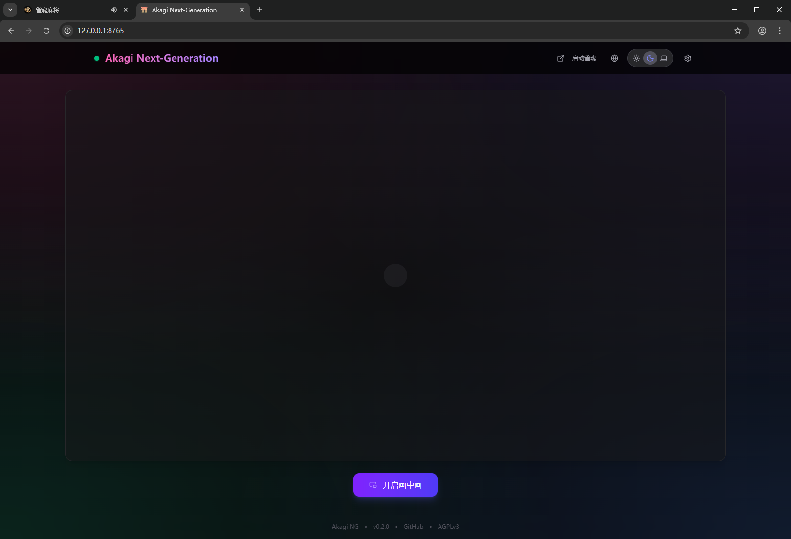
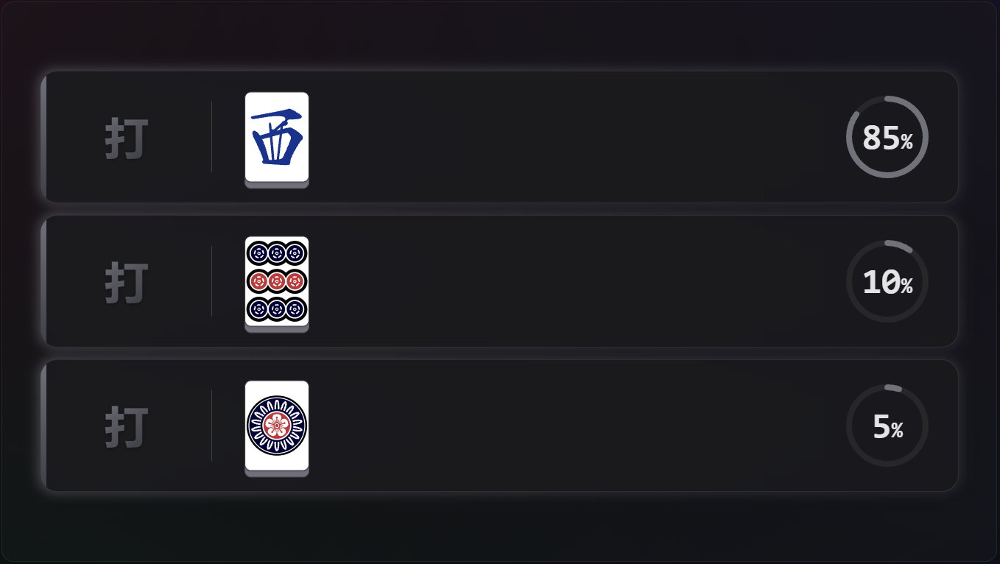
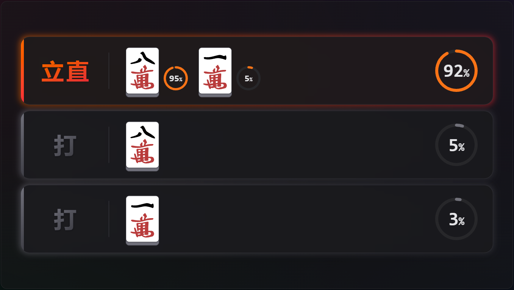
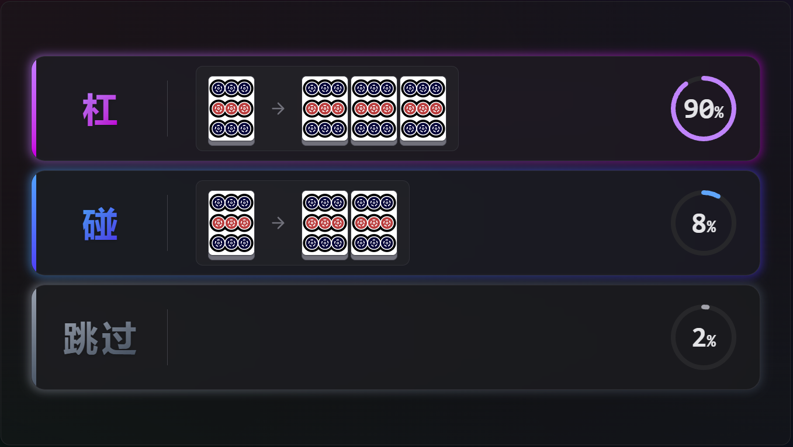
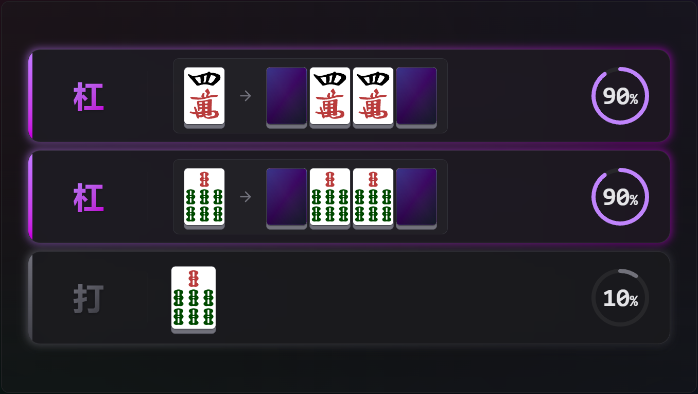
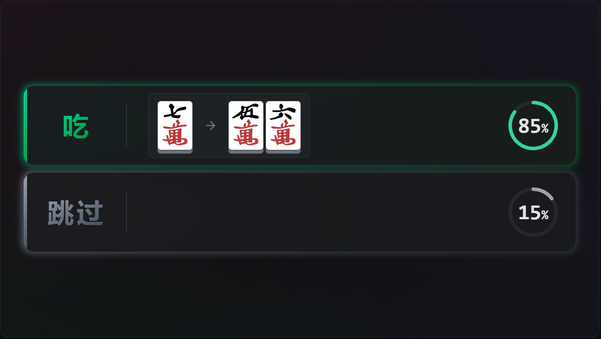

<div align="center">
  
  <h1>Akagi-NG</h1>

  <p>
    Next Generation Mahjong AI Assistant<br>
    Inspired by <b>Akagi</b> and <b>MajsoulHelper</b>
  </p>
<p><i>「死ねば助かるのに……」— 赤木しげる</i></p>

  
  
  
</p>

<p align="center">
  <b>简体中文</b> | <a href="./README.md">English</a>
</p>
</div>

---

## 什么是 Akagi-NG？

**Akagi-NG** 是原 **Akagi** 项目的次世代重构版本。

这是一款专为日本麻将（立直麻将）设计的 AI 辅助工具，旨在为 **雀魂麻将 (Mahjong Soul)** 的对局提供**实时局势分析与决策建议
**。

Akagi-NG 的核心理念：

- **现代化架构**：基于 Python 3.12 与 React/Vite 重构
- **解耦合设计**：核心逻辑、用户界面、配置管理与 AI 模型彻底分离
- **高性能推理**：集成 `libriichi` 获取极速的 Mortal 模型推理能力
- **长期可维护性**：优化的代码结构便于持续迭代

---

## ⚠️ 免责声明

本项目**仅供教育及研究使用**。

在网络游戏中使用第三方辅助工具可能违反游戏的服务条款 (Terms of Service)。  
Akagi-NG 的作者及贡献者**不对任何使用后果负责**，包括但不限于**账号被封禁或冻结**。

请您在使用前充分了解并自行承担相关风险。

---

## 功能特性

- 🎮 **支持平台**
    - 雀魂麻将 (Mahjong Soul)

- 🀄 **支持模式**
    - 四人麻将 (4p)
    - 三人麻将 (3p)

- 🤖 **AI模型**
    - Mortal (Mortal 4p / Mortal 3p)

- 🧠 **核心功能**
    - 实时手牌分析与 AI 何切推荐
    - 立直模拟推演 (Riichi Lookahead) - 智能推荐最佳立直舍牌
    - 完整的副露支持 (吃/碰/暗杠/加杠/大明杠)
    - 现代化的 Web 浮窗/叠加层 UI
    - 多语言支持 (简体中文 / 繁體中文 / 日本語 / English)


## 运行截图


### 主界面


### 常规舍牌推荐


### 立直模拟推演


### 碰/杠选项


### 杠牌选择界面


### 吃牌推荐



---


## 安装与使用

### 1. 下载程序

请前往 [Releases](../../releases) 页面下载最新版本的压缩包。

### 2. 部署资源

Akagi-NG 需要外部模型文件和依赖库才能运行。  
请确保 `akagi-ng.exe` 所在目录结构完整（需包含以下文件夹）：

```
akagi-ng/
  ├── akagi-ng.exe
  ├── config/          # 配置文件目录
  ├── lib/             # libriichi 本地扩展库 (.pyd)
  │     ├── libriichi.pyd
  │     └── libriichi3p.pyd
  └── models/          # Mortal 模型权重文件 (.pth)
        ├── mortal.pth
        └── mortal3p.pth
```

### 3. 启动

运行 `akagi-ng.exe`。程序将自动启动一个独立的浏览器窗口进入雀魂，并加载辅助 UI 界面。

---

## 源码构建指南

### 环境依赖

- Python **3.12+**
- Node.js & npm (用于编译前端)
- Windows (推荐开发环境)
- Git

### 1. 克隆与初始化

```bash
git clone https://github.com/Xe-Persistent/Akagi-NG.git
cd Akagi-NG

# 创建并激活虚拟环境
python -m venv .venv
.venv\Scripts\activate

# 安装开发依赖
pip install -e .
python -m playwright install
```

### 2. 编译前端资源

```bash
cd akagi_frontend
npm install
npm run build
```

### 3. 调试运行

```bash
python -m akagi_ng
```

### 4. 封装发布包

构建独立的 ZIP 发布包（包含可执行文件）：

```bash
python build_release.py
```

构建产物将生成于 `dist/` 目录下。

---

## 配置说明

配置文件位于 `config/settings.json`。支持修改以下内容：

- 应用程序基础设置
- AI 模型参数微调
- 界面显示偏好

---

## 开源协议

本软件遵循 [GNU Affero General Public License version 3 (AGPLv3)](LICENSE) 开源协议。
