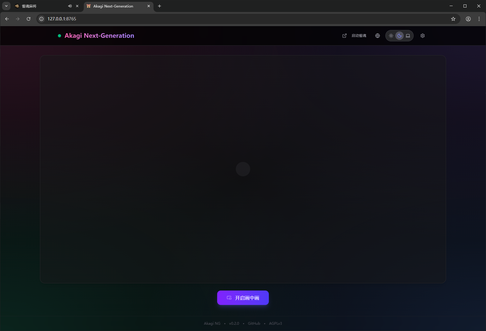

<div align="center">
  
  <h1>Akagi-NG</h1>

  <p>
    Next Generation Mahjong AI Assistant<br>
    Inspired by <b>Akagi</b> and <b>MajsoulHelper</b>
  </p>
<p><i>「死ねば助かるのに……」— 赤木しげる</i></p>

<p>
<a href="https://github.com/Xe-Persistent/Akagi-NG/actions/workflows/test.yml"></a>
<a href="https://github.com/Xe-Persistent/Akagi-NG/releases"></a>
<a href="https://github.com/Xe-Persistent/Akagi-NG/stargazers"></a>
<br>


<br>


<br>

<a href="https://discord.gg/Z2wjXUK8bN"></a>
<a href="https://codecov.io/gh/Xe-Persistent/Akagi-NG"></a>
</p>

<p align="center">
  <b>简体中文</b> | <a href="./README.md">English</a>
</p>
</div>

---

## 什么是 Akagi-NG？

**Akagi-NG** 是原 [Akagi](https://github.com/shinkuan/Akagi) 项目的次世代版本。

这是一款专为日本麻将（立直麻将）设计的 AI 辅助工具，旨在为线上麻将游戏对局提供实时局势分析与决策建议。

Akagi-NG 的核心理念：

- **前沿架构实践**：全面拥抱 Python 3.12、React 19 与 TS 6.0，以前沿工程标准构筑稳固、丝滑且高性能的系统基石。
- **极致性能推理**：深度集成 `libriichi` 高速 Rust 引擎，基于 Pytorch 提供 Mortal 系列 AI 模型的全速推理能力。
- **深度解耦设计**：决策核心与交互系统高度解耦，提供内置浏览器模式与 MITM 代理模式，灵活适配各类使用环境。
- **自研立直前瞻**：自研 `Riichi Lookahead` 前瞻技术，完整呈现模型在立直环节的隐含策略，补足 AI 决策盲区。

---

## 功能特性

- 🖥️ **兼容平台**
  - Windows 10 & 11
  - macOS (Apple Silicon only)
  - Linux

- 🎮 **支持游戏**
  - 雀魂麻将
  - 天凤
  - 麻雀一番街
  - 天月麻雀

- ✨ **核心功能**
  - 实时手牌分析与 AI 何切推荐
  - 立直前瞻 - 智能推荐最佳立直舍牌
  - 完整的副露支持 - 吃/碰/杠操作提示一目了然
  - 全新毛玻璃风格界面 - 丝滑且通透的视觉体验
  - 多语言支持 - 简体中文 / 繁體中文 / 日本語 / English

- 🤖 **AI 模型**
  - Mortal（四麻 / 三麻），始终作为离线回退模型加载
  - Akagi V3 云端推理（`/v3/react`），四麻与三麻可分别选择模型
  - 可直接在设置中检查 API 健康状态、密钥限额与有效期，以及可用模型

云端推理默认使用 `https://mjapi.shinkuan.me`，配置密钥并启用后才会生效。每次决策只上传当前座位视角下
已经隐藏化处理的本局 MJAI 事件流。实时请求超时为 2 秒，并采用 5–120 秒指数熔断退避；服务不可达、
被限流或密钥无效时会立即回退到内置 Mortal 模型。API 地址、密钥、开关与模型的修改会在下一次决策生效。

> [!NOTE]
> **Riichi Lookahead（立直前瞻）** 是 Akagi-NG 的一项核心功能，旨在解决“当 AI 建议立直时，我应该切哪张牌？”的问题。
>
> <details>
> <summary><b>点击查看立直前瞻的详细逻辑</b></summary>
>
> **1. 为什么需要它？**
>
> 当 AI 引擎 (Mortal Bot) 建议执行立直操作时，MJAI 协议返回的动作仅仅是 `{"type": "reach"}`，并不会直接告诉我们立直后应该切哪张牌（例如 `6m`）。然而，对于用户来说，点击“立直”按钮后，下一步必须切出一张牌。如果没有 Lookahead，用户只能瞎猜或者自己判断切哪张，这可能会导致 AI 建议的立直策略无法正确执行（例如切了错误的牌导致振听或放铳）。
>
> **2. 工作原理**
>
> Lookahead 的核心思想是**“模拟未来”**。当 AI 建议立直时，我们创建一个临时的平行宇宙，假设玩家已经声明了立直，然后问 AI 引擎在那个状态下会切什么牌。在这个“平行宇宙”中的一切模拟均不会影响到另一个真实的“主宇宙”。当前瞻完成后，我们只需要将前瞻得到的立直切牌推荐合并到主引擎的打牌推荐中即可。
>
> 流程分为以下几步：
>
> 1. **触发前瞻**：当前局面下，AI 引擎经过推理，认为“立直”排在推荐动作列表的前 3 名。
> 2. **启动模拟**：Akagi-NG 创建一个新的、临时的 `Lookahead Bot`。
> 3. **历史重放**：
>    - 本地前瞻使用 `can_act=False` 重放历史，因此重放阶段不会执行推理。
>    - V3 云端 API 是无状态服务，每次决策只接收一次已经隐藏化处理的当前牌局历史，不会为每条重放事件分别发起请求。
> 4. **分支收束**：
>    - 当状态完全恢复到“现在”后，我们手动向 AI 引擎发送一个“立直”事件。
>    - 使用 V3 云端推理时，Akagi-NG 会把选中的 `reach` 事件追加到上传的事件流。
> 5. **最终推理**：
>    - 在这个“宣布立直”的新状态下，我们发起一次后续推理请求：“现在最佳切牌是什么？”
>    - 引擎会根据局面分析，返回具体的切牌动作（例如 `打 6m`）。
> 6. **结果展示**：前端 UI 接收到这个`6m`的信息，界面上会既会高亮显示立直和其他切牌推荐（比如“默听”），也会在立直推荐的子条目展示建议打出的那张`6m`。若立直切牌候选多于 1 种，子条目中会分别展示每张立直切牌和置信度。
>
> </details>

## 演示视频

https://github.com/user-attachments/assets/701a3dcf-1574-46af-9594-082605c4e158

## 运行截图

### 主界面



### 设置面板


---

## 免责声明

> [!CAUTION]
> 本项目**仅供教育及研究使用**。
>
> 在网络游戏中使用第三方辅助工具可能违反游戏的服务条款。
> Akagi-NG 的作者及贡献者**不对任何使用后果负责**，包括但不限于**账号被封禁或冻结**。
>
> 请您在使用前充分了解并自行承担相关风险。

## 使用指南

### 1. 快速开始

1. **下载**: 前往 [Releases](../../releases) 下载对应平台的最新版本 Release 产物并完成安装/解压。
2. **运行**: 双击运行 `Akagi-NG`。
3. **对局**: 在 Dashboard 中点击“**启动游戏**”，点击右上角显示器图标开启 **HUD**。

### 2. 目录结构说明

为了确保程序正常运行，请检查 `Akagi-NG` 所在目录结构是否完整：

```plain
Akagi-NG/
  ├── Akagi-NG     # 主程序 (Electron 桌面端)
  ├── assets/      # 各平台相关的界面资源
  ├── bin/         # 后端核心程序所在的目录
  ├── config/      # 配置文件目录 (settings.json)
  ├── lib/         # libriichi 二进制扩展 (.pyd/.so)
  │     ├── libriichi
  │     └── libriichi3p
  ├── locales/     # 多语言支持资源
  ├── logs/        # 运行日志目录
  ├── models/      # AI 模型权重文件 (.pth)
  │     ├── mortal
  │     └── mortal3p
  ├── resources/   # 应用程序核心资源 (app.asar)
  ├── LICENSE      # 开源许可协议
  ├── README       # 极简使用说明
  └── ...          # 其他必要的运行时支持文件 (.dll, .pak 等)
```

### 3. 启动与退出

双击运行 `Akagi-NG` 后，程序将展示集成化的 Dashboard 主面板。您可以直接点击 Dashboard 中的“启动游戏”打开游戏浏览器窗口。

点击 Dashboard 右上角的显示器图标即可开启 HUD 界面。点击 Dashboard 右上角的 × 会将程序最小化至系统托盘。如需退出程序，请点击托盘右键菜单的 “Quit Akagi-NG”。

> [!TIP]
> **HUD (Heads-Up Display)** 是 Akagi-NG 的一项核心特性。它能够将辅助信息直接以半透明形式覆盖在游戏画面上，无需手动置顶窗口。

### 4. 配置

Akagi-NG 的所有配置均位于 `config/settings.json` 文件中。您可以点击 Dashboard 右上角的齿轮图标进入设置面板来调整程序行为。

### 5. 内置浏览器模式

这是 Akagi-NG 的**默认工作模式**，仅支持雀魂、天凤平台。

在此模式下，Akagi-NG 利用 Electron 核心管理一个专用的 Chromium 实例来运行游戏。

#### 核心优势

- **免配置**：无需证书或代理设置，一键启动。
- **环境隔离**：与您日常使用的浏览器完全隔离，互不干扰。
- **安全稳定**：直接从游戏服务器接收数据，稳定性高。

#### 使用方法

1. 运行 `Akagi-NG`。
2. 在 Dashboard 中点击“启动游戏”。

### 6. MITM 外部代理模式

Akagi-NG 支持通过中间人攻击 (MITM) 方式截获游戏数据，这允许您使用任意浏览器、游戏客户端或移动设备（配合代理）进行对局。

#### 使用方法

1. 在设置面板中启用“外部代理”。

2. 在系统中导入并信任 `~/.mitmproxy/` 下的 `mitmproxy-ca-cert.cer` 证书，以 Windows 为例，操作步骤如下：
   1. 双击该证书文件，点击 `安装证书` 按钮
   2. 若出现选项，请选 `本地计算机`，然后点击下一步
   3. 选择 `将所有证书放入下列存储`，然后点击 `浏览...`
   4. 选择 `受信任的根证书颁发机构`，确定，再点击下一步、完成
   5. 若提示要求权限，请选择 `是`

> [!IMPORTANT]
> 务必将证书安装到“**受信任的根证书颁发机构**”。

3. Akagi-NG 默认在本地 127.0.0.1:6789 启动一个 HTTP 代理服务器。您可以选择直接在 Dashboard 中点击“启动游戏”开始游玩，此时 Akagi-NG 的工作方式与内置浏览器模式类似。如果您希望使用系统浏览器或游戏客户端，还需配合代理软件与代理规则将游戏相关流量导向该代理。

> [!IMPORTANT]
> Steam 游戏客户端等进程需要在代理软件中开启 TUN / 增强模式，才能保证进程流量经过 Akagi-NG；此外还须注意避免回环代理，即确保从 Akagi-NG 发出的流量不会被导向自身。
>
> 浏览器网页端一般只需配置系统代理和域名规则即可，通常不需要开启 TUN / 增强模式。

<details>
<summary><b>点击查看详细代理规则配置方案</b></summary>

#### 配置方案 A: 浏览器网页（SwitchyOmega 代理，以雀魂麻将为例）

**配置步骤**：

1. **准备环境**：
   - 确保 Akagi-NG 已启动且 `mitm.enabled` 为 `true`（端口默认为 6789）。
   - Chrome/Edge 用户请在浏览器扩展商店搜索并安装 **SwitchyOmega**。

2. **配置情景模式**:
   - 打开 SwitchyOmega 设置界面。
   - 点击左侧 **新建情景模式** -> 命名为 `Akagi-Mitm` -> 类型选择 **代理服务器**。
   - 在 `Akagi-Mitm` 的设置中填写：
     - 协议：`HTTP`
     - 服务器：`127.0.0.1`
     - 端口：`6789`
   - 点击左侧 **应用选项** 保存。

3. **配置自动切换**:
   - 点击左侧 **自动切换** (auto switch)。
   - 删除所有现有规则（如果有）。
   - **添加规则**：
     - 域名通配符：`*.maj-soul.com  ->  Akagi-Mitm`
     - 域名通配符：`*.majsoul.com  ->  Akagi-Mitm`
     - 域名通配符：`*.mahjongsoul.com  ->  Akagi-Mitm`
   - **默认规则**：
     - 选择 **[系统代理]**，然后点击 **应用选项** 保存。

4. **开始游戏**:
   - 点击浏览器右上角 SwitchyOmega 扩展程序的图标，选择 **自动切换**。
   - 此时访问雀魂网页版，Akagi-NG 应能正常截获游戏流量。

#### 配置方案 B: Steam 游戏客户端（Clash 规则代理，以 Windows 平台、Clash Verge rev为例）

> 使用 Steam 客户端游玩时，请确保 Clash 处在 TUN 模式下，否则将无法代理客户端流量

1. **找到配置入口**:
   - 在 Clash Verge rev 客户端左侧点击“订阅”，找到您的配置文件，或者新建一个配置。

2. **添加代理节点 (Proxies)**:
   - 定义一个指向 Akagi-NG 本地代理的节点。

   ```yaml
   proxies:
     - name: Akagi-Mitm
       type: http
       server: 127.0.0.1
       port: 6789
       tls: false
   ```

   - 还可以定义一个代理组 (Proxy-groups)，里面包含本地代理节点和直连 (Direct)，这样方便切换是否使用 Akagi-NG 本地代理。

   ```yaml
   proxy-groups:
     - name: 🀄 雀魂麻将
       proxies:
         - Akagi-Mitm
         - DIRECT
       type: select
   ```

3. **添加分流规则 (Rules)**:
   - 以雀魂麻将为例，将雀魂相关域名指向上面定义的本地代理节点。请注意规则顺序，建议将规则放在靠前位置。

   ```yaml
   rules:
     # 这一条必须放在最前面，否则会导致回环代理
     - PROCESS-NAME,akagi-ng.exe,DIRECT
     # 客户端 / Steam
     - PROCESS-NAME,Jantama_MahjongSoul.exe,🀄 雀魂麻将
     # 网页端
     - DOMAIN-KEYWORD,maj-soul,🀄 雀魂麻将
     - DOMAIN-KEYWORD,majsoul,🀄 雀魂麻将
     - DOMAIN-KEYWORD,mahjongsoul,🀄 雀魂麻将
   ```

   - 雀魂麻将以外的其他平台代理规则与上方类似，只需将 `PROCESS-NAME` 规则替换为对应平台的客户端进程名即可。如下方所示：

   ```yaml
   rules:
     # 天凤
     - DOMAIN-KEYWORD,tenhou,🀄 雀魂麻将
     # 麻雀一番街
     - PROCESS-NAME,Mahjong-JP.exe,🀄 雀魂麻将
     # 天月麻雀
     - PROCESS-NAME,mahjongp.exe,🀄 雀魂麻将
   ```

4. **应用配置**:
   - 保存并刷新 Clash 配置。现在启动雀魂客户端，流量路径为：`雀魂客户端 -> Clash (TUN) -> 匹配到 Rules -> 转发给 Akagi-NG (6789) -> 您的网络/上游代理`

</details>

---

## 常见问题

#### Q: 内置的模型强度如何？

**A:** 以雀魂为例，Mortal 4p 的水平在**雀豪1**左右，Mortal 3p 的水平在**雀杰3**左右。

#### Q: 内置的模型太弱了，有没有更强的模型？

**A:** 有，请加入 [Discord 频道](https://discord.gg/Z2wjXUK8bN) 获取。

#### Q: 有没有自动打牌功能？

**A:** 很遗憾，Akagi-NG 暂不支持自动打牌功能。

---

## 源码构建指南

### 环境要求

- **Python 3.12**: 用于运行后端推理引擎。
- **Node.js 24 & npm**: 用于编译 Electron 桌面端和 React 前端。
- **Git**: 用于克隆项目仓库。

### 1. 项目初始化

克隆仓库并进入根目录：

```bash
git clone https://github.com/Xe-Persistent/Akagi-NG.git
cd Akagi-NG
```

#### 准备后端环境

集成构建脚本依赖于 `akagi_backend` 目录下的虚拟环境：

```bash
cd akagi_backend
python -m venv .venv

# Windows
.\.venv\Scripts\activate

# Linux/macOS
source .venv/bin/activate

pip install -e ".[dev]"
cd ..
```

根据你的系统平台准备 libriichi 二进制扩展并重命名：

```bash
# Windows
copy lib\libriichi-3.12-x86_64-pc-windows-msvc.pyd lib\libriichi.pyd
copy lib\libriichi3p-3.12-x86_64-pc-windows-msvc.pyd lib\libriichi3p.pyd

# macOS
cp lib/libriichi-3.12-aarch64-apple-darwin.so lib/libriichi.so
cp lib/libriichi3p-3.12-aarch64-apple-darwin.so lib/libriichi3p.so

# Linux
cp lib/libriichi-3.12-x86_64-unknown-linux-gnu.so lib/libriichi.so
cp lib/libriichi3p-3.12-x86_64-unknown-linux-gnu.so lib/libriichi3p.so
```

#### 安装前端与 Electron 依赖

在项目根目录下，执行安装：

```bash
npm install
```

### 2. 开发环境运行

在项目根目录下执行一键启动命令，会同时拉起后端、前端和 Electron 端：

```bash
npm run dev
```

### 3. 生产环境构建

执行以下命令，即可一键完成环境清理、版本号同步、后端编译、前端打包以及应用最终打包的全流程：

```bash
npm run build
```

构建产物将生成于 `dist/release` 目录下。

如需构建完全不写入 Electron、Chromium 或 Python 日志的便携版本，请在构建前设置
`AKAGI_NO_LOGS=1`。发布目录会包含 `.no-logs` 标记，并以 `OFF` 后端日志级别启动。

---

## 开源协议

本软件的主体代码遵循 [GNU Affero General Public License version 3 (AGPLv3)](LICENSE) 开源协议。

## 致谢与第三方资源声明

本项目发布版打包附带的 `lib`（包含 `libriichi` 二进制扩展）与 `models`（AI 模型权重）文件，均来源于项目 [shinkuan/Akagi](https://github.com/shinkuan/Akagi)。
这些编译的二进制文件与模型权重的版权归原作者所有，并在 AGPLv3 与 Commons Clause 协议下分发。在此向原作者的卓越工作与开源精神表示最诚挚的感谢！
